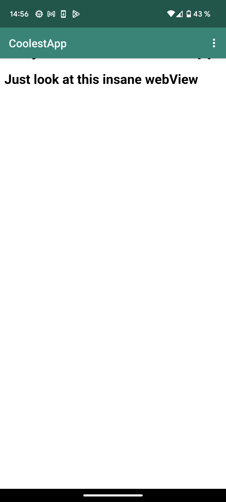

# Rapport

I denna uppgift har jag gett appen möjligheten att visa en hemsida inuti sig själv, denna hemsida kan vara extern genom en webbadress eller internt via en html fil lagrad på appen.
I min första commit ändrade jag namnet på appen och gav den tillgång till internetet, men även skapade jag ett WebView element:
```
<WebView
    android:id="@+id/my_webview"
    android:layout_width="match_parent"
    android:layout_height="match_parent"
    />
```
Genom att inkludera denna kod i "activity_main.xml" får appen ett WebView element som sedan kan användas för att presentera en hemsida.

```
import android.webkit.WebView;
import android.webkit.WebViewClient;
import android.webkit.WebSettings;
...
WebView myWebView;
...
myWebView = findViewById(R.id.my_webview);
myWebView.setWebViewClient(new WebViewClient()); 

WebSettings webSettings = myWebView.getSettings();
webSettings.setJavaScriptEnabled(true);
```

Sedan för att kunna interagera med detta WebView element skapas en private member variable med typen **WebView**, denna variabel tilldelas det element som skapades i tidigare steg genom findViewById() metoden, ytterligare skapas även en ny klient. Avslutningsvis får appen tillgång till javascript.

```
public void showExternalWebPage(){
    myWebView.loadUrl("https://his.se");
}

public void showInternalWebPage(){
    myWebView.loadUrl("file:///android_asset/index.html");
}
```
För att appen ska kunna ladda externa och interna sidor, användas två olika metoder tillsammans med loadUrl(). Dessa metoder kallas sedan när användaren väljer intern eller extern i appen.


När "showExternalWebPage" kallas.


När "showInternalWebPage" kallas.
